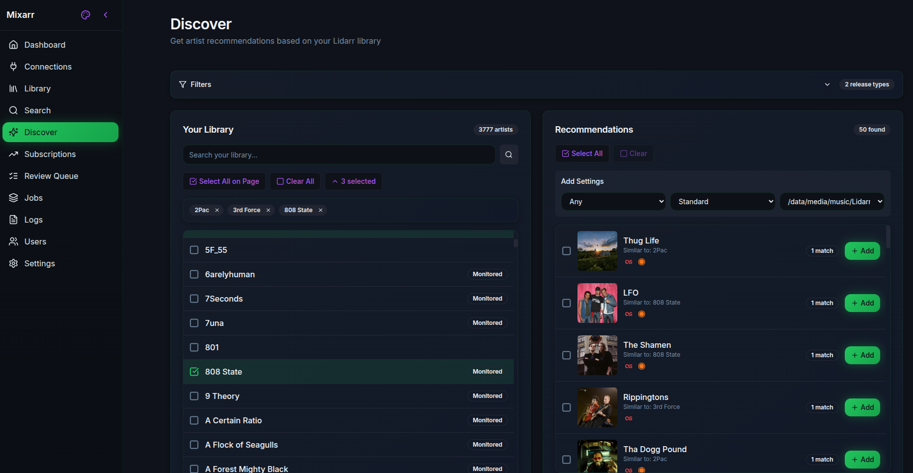

# Mixarr - Lidarr music discovery and search tool

[](https://aquantumofdonuts.github.io/mixarr/)
[](https://github.com/aquantumofdonuts/mixarr)
[](LICENSE)

**The missing piece for Lidarr.** Connect your music services, get AI-powered recommendations, and grow your collection on autopilot.

🌐 **[Visit the Website](https://aquantumofdonuts.github.io/mixarr/)** | 📖 **[Documentation](https://github.com/aquantumofdonuts/mixarr/wiki)**



## Features
- **Multi-Service Integration**: Spotify, TIDAL, Deezer, Last.fm, MusicBrainz, Plex/Tautulli
- **Automated Subscriptions**: Scheduled synchronization and discovery from connected services
- **System Dashboard**: Overview of active subscriptions, recent artists, and system health
- **Modern Stack**: Next.js 14 + Express.js + TypeScript
- **PWA Support**: Installable, offline-capable, push notifications
- **Multi-User**: Authentication with admin/user roles

## Install from Docker Image

**Docker Image:**
```
docker pull ghcr.io/aquantumofdonuts/mixarr:v1.1.0
```

**Docker Usage:**
```
docker run -d \
  --name mixarr \
  -p 3443:443 \
  -v ~/mixarr-data:/data \
  -e SESSION_SECRET="$(openssl rand -hex 32)" \
  -e FRONTEND_URL="https://YOUR-SERVER-IP:3443" \
  -e BASE_URL="https://YOUR-SERVER-IP:3443" \
  ghcr.io/aquantumofdonuts/mixarr:v1.1.0
```

## Build Docker from Source

**Docker Quick Start:**

```bash
# Clone the repository
git clone https://github.com/aquantumofdonuts/mixarr.git
cd mixarr

# Checkout the latest release
git checkout v1.1.0

# Copy environment template and configure
cp .env.example .env
# Edit .env with your settings (SESSION_SECRET, etc.)

# Build and start the production stack
docker compose up -d --build

# View logs
docker compose logs -f
```

Access:
- **HTTPS**: https://your-ip:3443 (recommended, via Caddy reverse proxy)
- **HTTP**: http://your-ip:3010 (direct API access)

On first login, create an admin account. Then connect your Lidarr instance and music services.

> **Updating**: To update to a new release, run `git fetch --tags && git checkout v1.x.x` then `docker compose up -d --build`


## Supported Music Services

### Spotify
Full OAuth integration for accessing your library, playlists, and personalized recommendations.
- Followed artists, saved albums, liked songs
- Any playlist by URL/ID
- New releases, featured playlists, category browsing
- Personalized playlists (Discover Weekly, Release Radar, Daily Mix, On Repeat)

> **Note**: Spotify's personalized playlists (Discover Weekly, Daily Mix, etc.) must be **followed/saved** in your Spotify library before the API can access them. Click the heart icon on the playlist in Spotify first.

### TIDAL
Full OAuth integration for HiFi music discovery.
- Followed artists, favorite tracks
- Playlists (individual or all)
- Discovery mixes, personalized mixes
- New arrival recommendations

### Deezer
Public API access works without authentication. OAuth features are currently unavailable as Deezer is not accepting new developer applications.

**Works without login:**
- Top chart artists
- Artists by genre
- Artist search

**Requires OAuth (currently unavailable):**
- Favorites, listening history, Flow
- Personal playlists

### Last.fm
Scrobble-based music discovery and charts.
- Global and country-specific charts
- Artists by genre/tag
- Geographic top artists
- Your personal library (top artists from scrobbles)
- Similar artists based on your listening

### Plex/Tautulli
Discover artists similar to what you've been listening to on Plex.
- Analyzes your Plex listening history via Tautulli
- Finds similar artists using Last.fm

### MusicBrainz
Open music database integration.
- New release discovery
- Artist metadata and matching

### ListenBrainz
Open listening history database.
- Your top listened artists
- Recommendations based on your listening
- Artists loved by similar users

### AI Recommendations
LLM-powered artist discovery using OpenAI, Anthropic, or Ollama.
- Natural language artist recommendations
- Based on your existing library and preferences


## Subscription Types

### Last.fm (5)
- **Top Charts**: Global weekly chart
- **Country Charts**: Top artists by country
- **Genre/Tag Artists**: Artists by genre tag
- **Geographic Artists**: Artists by location
- **Library Top Artists**: Your top scrobbled artists

### Spotify (13)
- **Followed Artists**: Your followed artists
- **Saved Albums Artists**: Artists from saved albums
- **Liked Songs Artists**: Artists from liked songs
- **Playlist**: Any playlist by URL
- **New Releases**: Recently released music
- **Featured Playlists**: Spotify curated playlists
- **Category Artists**: Artists from category playlists
- **Related Artists**: Similar to existing library
- **Artist Radio**: Artists from artist radio
- **Discover Weekly**: Personalized weekly recommendations
- **Release Radar**: New releases from followed artists
- **Daily Mix**: Daily personalized mixes
- **On Repeat**: Your most played tracks

### Deezer (8)
- **Favorites**: Requires OAuth (unavailable)
- **Listening History**: Requires OAuth (unavailable)
- **Flow Recommendations**: Requires OAuth (unavailable)
- **Playlist**: Requires OAuth (unavailable)
- **All Playlists**: Requires OAuth (unavailable)
- **Chart Artists**: Top chart artists (public API)
- **Genre Artists**: Artists by genre (public API)
- **Search Artists**: Artists by search query (public API)

### TIDAL (7)
- **Followed Artists**: Your followed artists
- **Favorite Tracks Artists**: Artists from favorite tracks
- **Playlist**: Individual playlist
- **All Playlists**: All saved playlists
- **Discovery Mix**: Personalized discovery
- **My Mix**: Personal mix
- **New Arrivals**: Personalized new releases

### MusicBrainz (1)
- **New Releases**: Recent releases from MusicBrainz database

### ListenBrainz (3)
- **Top Artists**: Your top listened artists 
- **Recommendations**: Artists recommended based on your listening
- **Similar Users Artists**: Artists loved by users with similar tastes

### AI (1)
- **Recommendations**: LLM-powered artist suggestions (OpenAI, Anthropic)

### Plex/Tautulli (1)
- **Listening History Similar**: Artists similar to your Plex listening


## Structure

```
├── apps/
│   ├── web/           # Next.js 14 frontend (React Server Components)
│   │   ├── src/app/   # App Router pages
│   │   ├── src/components/  # UI components
│   │   └── src/lib/   # Utilities, API client, hooks
│   └── api/           # Express.js backend
│       ├── src/routes/    # API endpoints
│       ├── src/services/  # Business logic
│       ├── src/jobs/      # Background workers
│       └── prisma/        # Database schema
├── packages/
│   ├── shared-types/  # TypeScript interfaces
│   └── config/        # Shared ESLint/TypeScript configs
├── docker-compose.yml # Development infrastructure
└── turbo.json         # Monorepo build orchestration
```

## Development Setup

### Prerequisites
- Node.js 20+
- Docker & Docker Compose
- npm 10+

### Local Development

```bash
# Clone and enter project
git clone https://github.com/chris-kc-cheng/mixarr.git
cd mixarr

# Install dependencies
npm install

# Start infrastructure (MySQL, Redis)
docker compose -f docker-compose.dev.yml up -d db redis

# Generate Prisma client
npm run db:generate

# Push database schema
npm run db:push

# Start development servers
npm run dev
```

Access:
- Frontend: http://localhost:3000
- API: http://localhost:3010
- API Health: http://localhost:3010/api/health

### Docker Development Stack

```bash
# Full containerized development environment
./start-dev.sh
```

Access:
- **HTTPS**: https://localhost:3443 (via Caddy reverse proxy)
- **HTTP**: http://your-ip:3010 (direct access, no SSL)

## Onboarding Steps

After starting Mixarr for the first time, complete these steps to get up and running:

### 1. Create Admin Account

On first launch, you'll be prompted to create an admin account. This account has full access to all settings and features.

### 2. Configure Base URL

Go to **Settings → Global Settings** and set your Base URL:
```
https://your-ip:3443
```
This is required for OAuth callbacks (Spotify, TIDAL, Plex SSO) to work correctly.

### 3. Connect to Lidarr (Required)

Mixarr needs a Lidarr connection to function. Go to **Connections → Add Lidarr**:

| Setting | Value |
|---------|-------|
| **URL** | Your Lidarr instance URL (e.g., `http://192.168.1.100:8686`) |
| **API Key** | Found in Lidarr → Settings → General → API Key |

Click **Test Connection** to verify, then save.

> **Recommended Lidarr Setting:** In Lidarr, go to **Settings → Media Management** and set **"Rescan Artist Folder after Refresh"** to **Never**. This prevents Mixarr's Library Health refresh features from triggering full library scans. New artists added from Mixarr will still have their folders scanned automatically.

### 4. Add Last.fm Connection (Recommended)

Last.fm provides artist metadata enrichment and music discovery features. Go to **Connections → Add Last.fm**:

1. Get a free API key at [Last.fm API](https://www.last.fm/api/account/create)
2. Enter your **API Key** and **Shared Secret**
3. (Optional) Enter your Last.fm username for personalized features

### 5. Configure AI Recommendations (Optional)

For AI-powered artist discovery, go to **Connections → Add AI**:

| Provider | Setup |
|----------|-------|
| **OpenAI** | API key from [OpenAI Platform](https://platform.openai.com/api-keys) |
| **Anthropic** | API key from [Anthropic Console](https://console.anthropic.com/) |
| **Ollama** | Local URL (e.g., `http://localhost:11434`), no API key needed |

### 6. Add Music Service Connections (Optional)

Add any services you use for music discovery:

| Service | Auth Type | Setup |
|---------|-----------|-------|
| **Spotify** | OAuth | Create app at [Spotify Developer Dashboard](https://developer.spotify.com/dashboard), set redirect URI |
| **TIDAL** | OAuth | Create app at [TIDAL Developer Portal](https://developer.tidal.com/), set redirect URI |
| **Deezer** | Public API | No setup needed for charts/search (OAuth currently unavailable) |
| **Plex/Tautulli** | API Key | Add Tautulli URL and API key for listening history analysis |
| **ListenBrainz** | Token | Add your ListenBrainz user token |

### 7. Create Your First Subscription

Go to **Subscriptions → Add** and create a subscription to start discovering artists:

- **Last.fm Top Charts**: Discover trending artists globally
- **Spotify Playlist**: Import artists from any playlist
- **AI Recommendations**: Get personalized suggestions based on your library

Artists will be added to your **Review Queue** for approval before being sent to Lidarr.

### Quick Verification

After setup, verify everything works:
1. Dashboard shows your Lidarr library stats
2. Search finds artists across connected services
3. Test subscription runs successfully

## Production Deployment

The default `docker-compose.yml` is configured for production. For development with hot-reload, use `docker-compose.dev.yml`.

### Prerequisites

1. **Generate a session secret**:
   ```bash
   openssl rand -base64 32
   ```

2. **Create `.env` file** with required secrets:
   ```env
   SESSION_SECRET=<your-generated-secret>
   MYSQL_ROOT_PASSWORD=<strong-root-password>
   MYSQL_PASSWORD=<strong-db-password>
   ```

### Start Production Stack

```bash
# Build and start all services
docker compose up -d --build
```

### Development Mode

For development with live code reloading:

```bash
docker compose -f docker-compose.dev.yml up -d --build
```

### HTTPS Certificates

The stack includes Caddy with auto-generated self-signed certificates. Your browser will show a security warning - this is expected for self-signed certs.

**To use your own certificates:**

1. Place your certificate files in a `certs/` directory
2. Update the Caddyfile to reference your certs:
   ```
   tls /path/to/cert.pem /path/to/key.pem
   ```
3. Restart Caddy: `docker compose restart caddy`

### Ports

| Port | Protocol | Description |
|------|----------|-------------|
| 3443 | HTTPS | Main access point (Caddy reverse proxy) |
| 3080 | HTTP | Redirects to HTTPS |
| 3010 | HTTP | Direct web access (bypasses Caddy) |

## Spotify OAuth Setup

Spotify requires HTTPS for OAuth redirect URIs (except localhost). This stack includes Caddy as a reverse proxy to handle HTTPS automatically.

### Setup Steps

1. **Start the stack**:
   ```bash
   docker compose up -d
   ```

2. **Configure Base URL** in Settings → Global Settings:
   ```
   https://your-ip:3443
   ```

3. **Create a Spotify App** at [Spotify Developer Dashboard](https://developer.spotify.com/dashboard):
   - Click "Create App"
   - Set Redirect URI to: `https://your-ip:3443/api/connections/{connection-id}/spotify/callback`
   - Copy the Client ID and Client Secret

4. **Add Spotify Connection** in the app:
   - Go to Connections → Add Spotify
   - Enter Client ID and Client Secret
   - Click "Authorize" to complete OAuth flow

> **Note**: Your browser will show a certificate warning for the self-signed certificate. This is expected - click "Advanced" → "Proceed" to continue.

## TIDAL OAuth Setup

TIDAL OAuth requires HTTPS for redirect URIs (similar to Spotify).

### Setup Steps

1. **Create a TIDAL App** at [TIDAL Developer Portal](https://developer.tidal.com/):
   - Create a new application
   - Set Redirect URI to: `https://your-ip:3443/api/connections/{connection-id}/tidal/callback`
   - Copy the Client ID and Client Secret

2. **Add TIDAL Connection** in the app:
   - Go to Connections → Add TIDAL
   - Enter Client ID and Client Secret
   - Click "Authorize" to complete OAuth flow

3. **Create Subscriptions** for TIDAL sources:
   - Followed Artists
   - Playlists (individual or all saved)
   - Discovery/Personalized Mixes

## Application Features

### Review Queue
Artists discovered by subscriptions land in the Review Queue for manual approval before adding to Lidarr. You can:
- Preview artist details and albums
- Add to Lidarr with quality profile selection
- Dismiss artists you don't want
- Bulk process multiple artists

### Subscriptions
Automated artist discovery from 37+ sources across all services. Each subscription runs on a schedule and adds discovered artists to your Review Queue or directly to Lidarr.

### Discover Page
Browse new music across services:
- Spotify new releases and featured playlists
- TIDAL discovery mixes
- Deezer charts and genres
- Last.fm charts and tags

### Search
Universal artist search across:
- Lidarr (existing library)
- Spotify, TIDAL, Deezer
- Last.fm, MusicBrainz

### Label Browsing
Click any record label to browse all artists on that label.

### User Management
Multi-user support with admin/user roles. Admins can create users and manage permissions.

### SSO Authentication
Enterprise single sign-on options:
- **Google OAuth**: Sign in with Google accounts
- **LDAP/Active Directory**: Enterprise directory integration
- **SAML 2.0**: Enterprise identity provider support
- **Plex**: Sign in with your Plex account

#### Google OAuth Setup
1. Go to [Google Cloud Console](https://console.cloud.google.com/apis/credentials)
2. Create a new OAuth 2.0 Client ID (Web application)
3. Add this **Authorized redirect URI**:
   ```
   https://your-domain:3443/api/auth/sso/google/callback
   ```
4. Copy the Client ID and Client Secret to Mixarr's SSO settings

#### SAML 2.0 Setup
Configure your Identity Provider with:
- **ACS URL**: `https://your-domain:3443/api/auth/sso/saml/callback`
- **Entity ID**: `https://your-domain:3443`

### Notifications
Receive alerts via Discord webhooks or generic webhooks:
- Subscription completed/failed
- Artist added to Lidarr
- Review queue has pending items
- Metadata enrichment completed

### Library Health
Analyze and maintain your Lidarr library:
- **Health Dashboard**: Overview of library completeness
- **Issue Detection**: Find artists missing albums, posters, bios, or genres
- **Duplicate Detection**: Scan for and resolve duplicate artists
- **Metadata Enrichment**: Auto-fill missing data from Last.fm, Deezer, Discogs
- **Bulk Refresh**: Trigger metadata refresh for incomplete artists

### Dashboard
System overview with:
- Active subscription count and status
- Recent activity feed (artists added, subscriptions run)
- Connection health summary
- Review queue stats

### Public Playlist Import
Import artists from Spotify public playlists without OAuth:
- Paste any public playlist URL
- Preview artists before importing
- Add to review queue or directly to Lidarr

### Connections
Configure API connections for:
- Lidarr (required)
- Spotify (OAuth)
- TIDAL (OAuth)
- Last.fm (API key)
- Plex/Tautulli (API key)
- AI (OpenAI, Anthropic, Ollama)

### Jobs
Background job monitoring:
- View running and completed jobs
- Real-time progress via WebSocket
- Retry failed jobs


## PWA Installation

1. Open the app in Chrome/Edge/Safari
2. Click "Install" in the address bar or menu
3. The app will be available as a standalone application

## Architecture

### Frontend (apps/web)
- **Framework**: Next.js 14 with App Router
- **Styling**: Tailwind CSS with dark mode
- **Components**: Custom Shadcn/UI-inspired components
- **State**: React hooks + Context API
- **Real-time**: WebSocket hooks for live updates

### Backend (apps/api)
- **Framework**: Express.js with TypeScript
- **ORM**: Prisma with MySQL
- **Auth**: Passport.js (local, Google, LDAP, SAML, Plex)
- **Queue**: BullMQ with Redis
- **WebSocket**: Socket.IO

### Services
- **Lidarr**: Artist management and search
- **Spotify**: Library imports, playlists
- **TIDAL**: HiFi library, playlists, discovery
- **Deezer**: Charts, genres, search (public API)
- **Last.fm**: Charts, tags, geo data, scrobbles
- **MusicBrainz**: Artist metadata


## API Endpoints

| Endpoint | Description |
|----------|-------------|
| `GET /api/health` | Health check |
| `POST /api/auth/login` | User login |
| `GET /api/connections` | List connections |
| `GET /api/search/artist` | Search artists |
| `GET /api/subscriptions` | List subscriptions |
| `GET /api/imports` | List import sources |
| `GET /api/jobs` | List background jobs |
| `GET /api/logs` | View application logs |
| `GET /api/settings` | Get user settings |

## Contributing

1. Create a feature branch from `dev`
2. Make changes with proper TypeScript types
3. Run `npm run lint && npm run typecheck`
4. Submit a pull request

## License

GPLv3 - see LICENSE file for details
